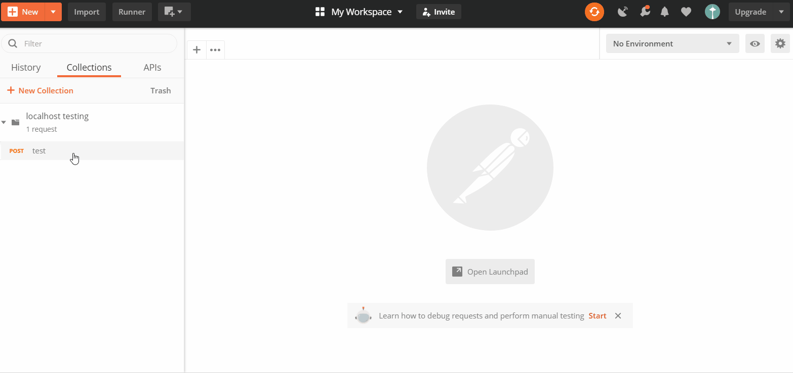

# Useful postman random function for tests
Script to generate random global variable to use in request params, headers, body, etc

## Step to generate random global variable for postman test
1. create a request
2. go to pre-request script
3. put [following script](main.js) (refer [example](sample.js))
4. run the request, so it will initial the value of your global variable
5. go to the **body** tab of the request that you want to use global variable
6. value put {{$yourGlobalVariable}}

## Function list
function | description | sample
--- | --- | ---
randNumber(length) | generate random number by length | length = 1 will generate number from 0 to 9
randFixNumber(length) | generate random number with leading zero by length | length = 2 will generate number from 00 to 99
randNumberByRange(min, max) | generate random number by range | min = 2, max=5 will generate number from 2 to 5
randFixNumberByRange(min, max) | generate random number with leading zero by range | min = 9, max = 15, will generate number from 09 to 15
randChoice(text) | generate random text from options, use **/** for separator  | text = "M/F", will generate text "M" or "F"
